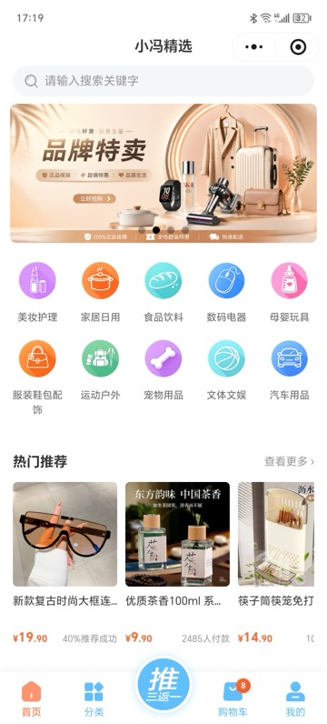
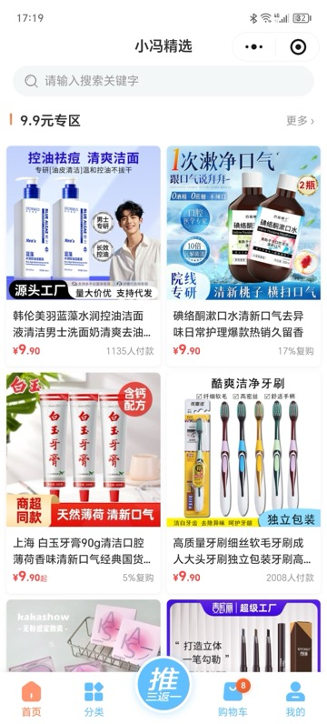
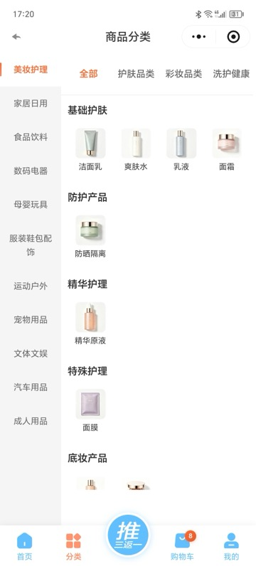
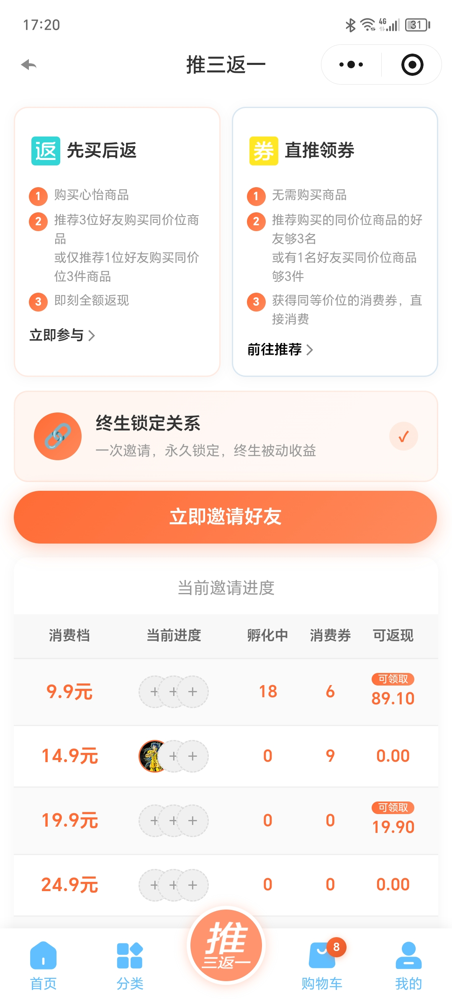
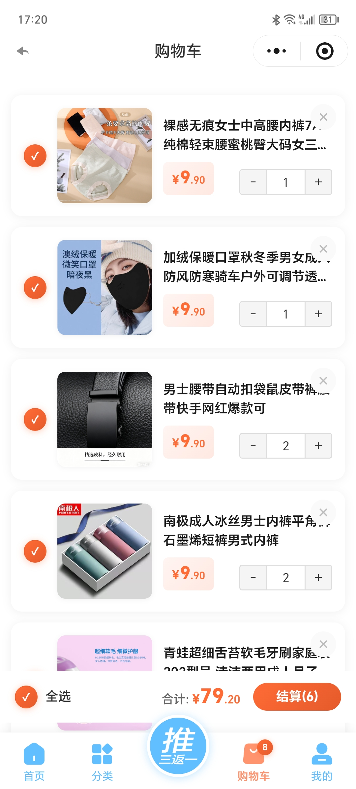
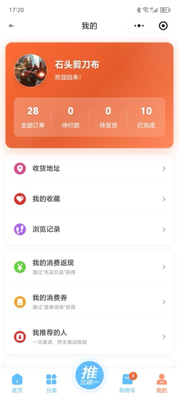

# 推三返一商城 (recommended-shop)

> **项目合作，添加微信：shijianbubu**

基于微信小程序 + Node.js 后端 + Vue 管理后台的社交电商平台，核心采用**「推三返一」裂变模式**实现用户自增长。

微信小程序前端使用 **uni-app** 跨平台框架开发，一套代码可同时发布到微信小程序、H5、Android App、iOS App 以及其他主流平台，具备极强的扩展性和多端覆盖能力。

---

## 🎯 核心商业模式：推三返一

### 业务概述

**核心规则**：推荐三个人各买一份，或者推荐一个人买三份，推荐人的一份即可免单。

**商业模式**：**推荐人受益免费购买商品，被推荐人支付自己订单的正常费用**。

### 核心规则

#### 推荐关系
- 一旦建立推荐关系，永久绑定
- 关系不可更换、不可取消

#### 价格档位
- 商品有固定价格档位：9.9、14.9、19.9、24.9、29.9……
- 每档独立核算

#### 券的类型（都给推荐人）

| 类型 | 归属 | 说明 | 生成条件 | 激活条件 |
|---|---|---|---|---|
| **消费券** | 推荐人 | 仅限同等价位商品使用 | 被推荐人购买的同等价位商品累计满3件（推荐人还没在该档位购买或累计不足） | 被推荐人订单确认收货后 |
| **提现券** | 推荐人 | 可叠加累计，视为余额使用 | 被推荐人购买金额达到推荐人购买金额的3倍 | 推荐人与被推荐人订单都确认收货后 |

#### 券的使用规则

**消费券（给推荐人用）**
- ✅ 仅限**同等价位**使用
- ❌ 19.9的消费券不能用于9.9的商品支付
- ❌ 不可提现，仅可用于推荐人购物抵扣

**提现券（给推荐人，可退款/余额）**
- ✅ 可累计叠加：19.9 + 9.9 = 29.7
- ✅ 视为余额使用
- ✅ 可购买**低于累计金额**的任何商品

---

## 📋 具体场景流程

### 场景1：被推荐人先购买，推荐人后购买（先生成消费券）

| 步骤 | 操作 | 结果 |
|---|---|---|
| 1 | 被推荐人购买3件9.9元商品 | 被推荐人累计购买3×9.9 = 29.7<br/>满足条件：每满3件生成一张推荐人的消费券 |
| 2 | 生成**消费券**一张，金额9.9元 | 归属：推荐人<br/>状态：孵化中 |
| 3 | 被推荐人订单确认收货 | 消费券激活为"可用"状态，推荐人可用它免费购买一件9.9元商品 |

> 被推荐人自己购买，持续为推荐人生成消费券，数量不限。

### 场景2：推荐人先购买，被推荐人后购买（生成提现券）

**核心原则**：只要推荐人在该价格档位已购买≥1件，被推荐人再购买累计达到推荐人购买×3件时，就生成推荐人的提现券。

| 步骤 | 操作 | 结果 |
|---|---|---|
| 1 | 推荐人购买1件9.9元商品 | 支付9.9元 |
| 2 | 被推荐人购买（不管是一次买3件，还是分多次） | 被推荐人累计购买到3件9.9元商品 |
| 3 | 被推荐人累计购买达到3件时 | 推荐人购买金额1×9.9 = 9.9<br/>被推荐人购买金额3×9.9 = 29.7<br/>29.7 ÷ 9.9 = **3倍**，满足条件 |
| 4 | 生成**推荐人的提现券** | 归属：推荐人<br/>状态：孵化中 |
| 5 | 推荐人与被推荐人订单都确认收货 | 提现券激活为"待提现"状态 |

> 无论被推荐人是先买够3件还是后买够3件，只要推荐人在该价格档位已经购买过，都生成提现券而不是消费券。

---

## 🔍 核心判断逻辑

### 被推荐人购买时的判断（订单支付成功后）

```
对于每个价格档位：
  1. 统计被推荐人累计购买件数
  2. 统计推荐人累计购买件数

  情况A：推荐人在该档位已购买 ≥ 1件
    被推荐人累计购买 ≥ 推荐人购买 × 3  →  生成推荐人的提现券

  情况B：推荐人在该档位未购买或累计不足
    被推荐人累计购买每满3件  →  生成推荐人的消费券
```

### 推荐人购买时的判断（订单支付成功后）

```
对于每个价格档位：
  1. 统计推荐人刚购买的件数
  2. 统计被推荐人累计购买件数

  被推荐人累计购买 ≥ 推荐人累计购买 × 3  →  生成推荐人的提现券
```

### 注意事项
- 每**价格档位**独立核算
- 只计算**同一价格档位**的商品
- 累计件数时按 `goods_num` 计算，不是订单记录数

---

## 🔄 状态流转

### 提现券状态

```
孵化中(0) → 待提现(5) → 已提现(6)
```

### 消费券状态

```
孵化中(0) → 可用(1) → 已使用(2)
```

---

## ⚠️ 边界情况

| 场景 | 处理方式 |
|---|---|
| 推荐人买了多份 | 按每份分别计算返券 |
| 被推荐人买了超3倍（比如4份） | 按3倍返，第4份继续累积，可能触发下一轮返券 |
| 被推荐人先买了1件或2件，推荐人再去购买，然后被推荐人补够3件 | 只要推荐人在该档位已购买过，补够3件时生成推荐人的提现券 |
| 被推荐人分多次购买到3件 | 累计达到条件时立即生成相应券 |
| 同一个被推荐人多个订单 | 按价格档位累计所有订单的商品件数 |

---

## 💰 退款与消费券

### 退款方式

管理员在后台对订单执行退款操作时，支持三种退款方式：

| 退款方式 | 说明 | 生成的消费券类型 |
|---------|------|----------------|
| 线下退款 (type=1) | 仅标记订单为已退款，不生成消费券 | 无 |
| **退成消费券** (type=2) | 退款金额转为用户的**消费券**（coupon_type=1, source=refund） | 消费券 |
| **退成消费返现** (type=3) | 退款金额转为用户的**提现券**（coupon_type=2, source=refund） | 提现券 |

### 防重复计费规则

退款来源的券使用时不产生新碎片——这是防止同一笔钱被重复计算推荐收益的关键规则：

```
原订单(微信支付¥9.9) → 推荐人获得碎片 ✓   （正常，只算一次）
        ↓ 退款
退款转消费券(source=refund)
        ↓ 用户使用该券下单
新订单(消费券支付) → 推荐人不获得碎片 ✗   （避免双重计费）
```

对比：通过碎片合成的消费券（`source=fragment`）使用时，**正常触发**推荐体系，为上级产生新碎片。因为这是真实的购物行为。

### 微信支付绑定继承

退款产生的消费券会记录原订单的微信支付信息（`source_payment_no`）。当用户使用这类消费券下单时，新订单自动继承原订单的 `payment_no` 和 `linked_order_id`，确保即使消费券支付的订单本身没有微信交易记录，也能完成微信发货通知。

### 完整流程图

```
┌─────────────────────────────────────────────────────────────┐
│                    正常购买流程                               │
│                                                             │
│  C付¥9.9(微信) ──→ 订单A ──→ A的推荐人得碎片                │
│       │                                                      │
│       ├── 碎片满3张 ──→ 合成消费券(source=fragment)          │
│       │                    ↓                                │
│       │              A用券购物 ──→ A的上级得碎片 ✓           │
│       │                                                      │
│       └── 管理员退款(type=2/3)                              │
│                            ↓                                │
│                   退款券(source=refund)                      │
│                            ↓                                │
│                     用户用退款券购物                          │
│                            ↓                                │
│                   不产生新碎片 ✗ （防重复计费）               │
└─────────────────────────────────────────────────────────────┘
```

---

## 🏗️ 技术架构

```
┌─────────────────────────────────────────────────────┐
│                    用户端                            │
│         微信小程序 (Taro/uni-app)                    │
│     shop-client/                                    │
├─────────────────────────────────────────────────────┤
│                  管理后台                            │
│       Vue 3 + Vuestic UI + TypeScript               │
│   vuestic-admin/                                    │
├─────────────────────────────────────────────────────┤
│                   API 服务                           │
│          Node.js + Express + MySQL                   │
│      backend/                                        │
├──────────────────┬──────────────────────────────────┤
│   1688 开放平台   │        微信支付 / 小程序            │
│  商品采集 & 采购  │     发货通知 / 订阅消息             │
└──────────────────┴──────────────────────────────────┘
```

### 核心优势

1. **零成本获客** — 用户为拿回本金主动分享，每个付费用户带来 3 个用户
2. **高转化率** — 推荐关系基于真实社交链，信任度高，转化率远超传统广告
3. **复购驱动** — 返还后余额刺激二次消费，形成正向循环
4. **自动裂变** — 无需额外营销投入，用户自发传播
5. **现金流健康** — 先收款后返还，资金沉淀可用于采购和运营

### 与传统模式的对比

| 维度 | 推三返一 | 传统电商 | 拼团/砍价 |
|------|---------|---------|-----------|
| 获客成本 | 近乎为零 | 高（流量费） | 中等 |
| 用户粘性 | 高（有返利预期） | 低 | 中等 |
| 裂变速度 | 指数级 | 线性 | 较快 |
| 合规风险 | 需注意层级限制 | 低 | 中等 |
| 适合场景 | 新品牌冷启动 | 成熟品牌 | 清库存 |

---

## 📁 项目结构

```
recommended-shop/
├── backend/                     # Node.js 后端服务
│   ├── controllers/             # 业务控制器
│   │   ├── 1688.js              # 1688 集成（采集/下单/支付/物流/Webhook）
│   │   ├── order.js             # 订单管理
│   │   ├── referral.js          # 推荐返利逻辑
│   │   ├── goods.js             # 商品管理
│   │   ├── coupon.js            # 消费券管理
│   │   ├── payment.controller.js # 支付处理
│   │   └── ...
│   ├── services/                # 业务服务层
│   │   ├── 1688.service.js      # 1688 API 封装
│   │   ├── payment.service.js   # 支付服务
│   │   └── cos.service.js       # 腾讯云 COS 文件存储
│   ├── routes/                  # 路由定义
│   ├── config/                  # 配置（数据库/环境变量）
│   ├── migrations/              # 数据库迁移脚本
│   └── app.js                   # 应用入口
│
├── vuestic-admin/               # Vue 3 管理后台
│   └── src/pages/
│       ├── orders/              # 订单管理（含1688同步）
│       ├── products/            # 商品管理（含1688采集）
│       ├── product-categories/  # 分类管理（4级树形）
│       └── settings/            # 系统设置（三方接口配置）
│
├── shop-client/                 # 微信小程序前端
│   ├── pages/                   # 页面
│   │   ├── index/               # 首页
│   │   ├── goods/               # 商品详情
│   │   ├── order/               # 下单/订单列表
│   │   ├── referral/            # 推荐返利页
│   │   ├── pay/                 # 支付页
│   │   └── user/                # 个人中心
│   ├── components/              # 组件
│   └── common/                  # API 请求封装
│
├── deploy-backend.sh            # 后端部署脚本
├── deploy-admin.sh              # 前端部署脚本
└── docs/                        # 文档
    └── 1688-integration-pre-dev.md
```

---

## ✨ 核心功能

### 1. 1688 一键代发集成
- **商品采集**：从 1688 批量采集商品信息、SKU、价格、图片
- **自动下单**：用户下单后自动在 1688 创建采购订单
- **免密支付**：支持 1688 协议支付，无需手动确认
- **物流同步**：
  - 手动同步：管理后台一键获取快递单号
  - 自动同步：Webhook 监听 1688 发货事件，实时推送
- **微信发货通知**：发货后自动调用微信 `recordShippingInfo` 上报

### 2. 推三返一裂变系统
- **邀请码体系**：每位用户拥有唯一邀请码
- **分享链接**：生成微信小程序 URL Scheme，打开即绑定关系
- **碎片机制**：每笔有效订单产生碎片，满3张合成消费券/提现券
- **双券体系**：消费券（同价位抵扣）+ 提现券（余额可提现）

### 3. 多种支付方式
- 微信支付（JSAPI）
- 余额支付
- 消费券支付（可叠加使用）

### 4. 商品与分类
- 4 级分类树（一级→二级→三级→四级）
- SKU 多规格管理
- 1688 来源标识
- 采购成本追踪

---

## 🚀 快速开始

### 环境要求

- Node.js >= 18
- MySQL >= 8.0
- Redis（可选，用于缓存）
- 1688 开放平台账号（如需代发功能）
- 微信小程序账号（如需小程序端）

### 后端启动

```bash
cd backend
cp .env.example .env   # 编辑数据库等配置
npm install
npx sequelize-cli db:migrate  # 执行数据库迁移
npm run dev             # 开发模式 (nodemon)
# 或
pm2 start app.js --name backend-api  # 生产模式
```

### 管理后台启动

```bash
cd vuestic-admin
npm install
npm run dev             # 开发模式
npm run build           # 构建生产版本
```

### 小程序启动

```bash
cd shop-client
# 使用 HBuilderX 打开项目
# 或使用 CLI:
npm install
npm run dev:mp-weixin   # 编译为微信小程序
```

---

## 🔑 关键配置项

在管理后台 `网站设置 > 三方接口` 中配置：

| 配置项 | 说明 |
|--------|------|
| 1688 AppKey/Secret | 1688 开放平台凭证 |
| 1688 回调地址 | Webhook 消息接收地址 |
| 微信 AppID/Secret | 小程序凭证 |
| 微信支付商户号 | 支付配置 |
| 腾讯云 COS | 文件存储（可选） |

---

## 📊 数据库主要表结构

### shop_coupon（消费券/提现券）

| 字段 | 说明 |
|---|---|
| `coupon_type` | 1=消费券（给推荐人），2=提现券（给推荐人） |
| `source` | 来源：`fragment`=碎片合成（默认），`refund`=退款产生，`admin`=手动发放 |
| `price_tier` | 价格档位 |
| `status` | 状态（0=孵化中, 1=可用, 2=已使用, 5=待提现, 6=已提现） |
| `inviter_id` | 推荐人ID（这张券的拥有者） |
| `invitee_id` | 被推荐人ID |
| `invitee_order_id` | 被推荐人订单ID |
| `original_order_id` | 推荐人原始订单ID（如果是提现券） |
| `order_ids` | JSON数组，记录哪些商品碎片生成了此券 |
| `source_order_id` | 来源订单ID（退款场景） |
| `source_payment_no` | 来源订单微信支付流水号（用于券支付订单继承微信绑定） |

### shop_order（订单主表）

| 字段 | 说明 |
|---|---|
| `purchase_order_id` | 1688采购单号 |
| `used_coupon_ids` | 使用的消费券ID列表（逗号分隔） |
| `linked_order_id` | 关联的原订单ID（券支付订单继承微信支付信息时使用） |

### 其他主要表

| 表名 | 说明 |
|------|------|
| `shop_member` | 会员表（含 invite_code, inviter_id, referral_count） |
| `shop_order_goods` | 订单商品明细（含 purchase_cost 采购成本） |
| `shop_goods` | 商品主表（含 source_url 1688来源链接） |
| `shop_goods_sku` | 商品SKU表 |
| `shop_category` | 分类表（4级树形，parent_id 自引用） |
| `site_settings` | 系统设置（键值对） |

---

## � 关键触发点

### 订单支付成功后
- **如果是被推荐人购买**：
  - 检查该用户是否有推荐人
  - 按价格档位统计累计购买情况
  - 判断满足条件，生成推荐人相应类型的券（消费券或提现券）
- **如果是推荐人购买**：
  - 检查该用户的被推荐人
  - 按价格档位统计被推荐人累计购买情况
  - 如果满足条件，生成推荐人的提现券

### 订单确认收货后
- 检查该订单关联的券
- 如果是消费券：激活为"可用"
- 如果是提现券：检查推荐人与被推荐人订单是否都已收货，如果是则激活为"待提现"

---

## � 三方接口技术集成

本项目深度集成了 **1688 开放平台** 和 **微信支付/小程序** 的多项 API，实现商品采集、自动采购、免密支付、物流同步、提现转账等全链路自动化。

### 一、1688 开放平台 API

> 文档地址：https://open.1688.com/api/apidocdetail.htm

#### 1. 商品采集（手动 & 自动）

| 功能 | API 接口 | 说明 |
|------|---------|------|
| **获取商品详情** | `alibaba.fenxiao.productInfo.get` | 通过 offerId 获取 1688 商品完整信息（标题、图片、SKU、价格、规格等） |
| **URL 解析** | 内部逻辑 | 从 `https://detail.1688.com/offer/{offerId}.html` 提取商品 ID |
| **数据转换** | 内部逻辑 | 将 1688 原始数据转换为本地商品格式，自动添加 `?sk=consign` 代发参数 |

**采集流程**：管理后台输入 1688 商品链接 → 解析 offerId → 调用 `productInfo.get` → 数据清洗转换 → 入库（含 SKU、分类、价格等）

#### 2. 自动采购下单

| 功能 | API 接口 | 说明 |
|------|---------|------|
| **创建分销采购订单** | `alibaba.trade.fenxiaoOrder.create` | 用户在我们系统下单后，自动在 1688 创建对应的分销采购订单 |
| **取消采购订单** | `alibaba.trade.cancel` | 取消未支付的 1688 采购订单 |
| **加入分销铺货** | `alibaba.fenxiao.buyer.outshop.add` / `outproduct.relation.add` | 将 1688 商品加入我们的分销铺货列表 |

**下单流程**：用户支付成功 → 匹配 1688 商品 + SKU → 调用 `fenxiaoOrder.create` → 获得 1688 订单号(tradeId) → 存入本地订单

#### 3. 免密支付（协议代扣）

| 功能 | API 接口 | 说明 |
|------|---------|------|
| **检查免密协议状态** | `alibaba.trade.pay.protocolPay.isopen` | 检查是否已开通 1688 免密支付协议 |
| **发起免密扣款** | `alibaba.trade.pay.protocolPay.preparePay` | 创建 1688 采购订单后自动扣款，无需人工确认 |
| **查询支付渠道** | `alibaba.trade.payWay.query` | 查询 1688 订单可用的支付方式 |
| **收银台支付链接** | `alibaba.trade.grouppay.url.get` | 未开通免密时生成 1688 收银台支付链接 |

**支付策略**：优先尝试免密支付 → 若未开通则返回收银台链接

#### 4. 物流信息同步

| 方式 | API 接口 / 机制 | 说明 |
|------|-----------------|------|
| **手动同步** | `alibaba.trade.getLogisticsInfos.buyerView` | 管理后台点击"同步物流"，主动调用该接口获取快递公司+单号 |
| **自动同步（Webhook）** | `ORDER_BUYER_VIEW_ANNOUNCE_SENDGOODS` | 1688 卖家发货后，通过 HTTP 回调自动推送消息到我们的服务器 |

**Webhook 配置**：
- 消息类型：买家视角的发货通知
- 发送通道：HTTP Callback
- 回调地址：`POST https://your-domain.com/api/1688/webhook/sendgoods`
- 触发条件：1688 卖家点击"发货"后立即推送

**完整物流链路**：
```
1688卖家发货
    ↓ (HTTP Webhook 自动推送)
POST /api/1688/webhook/sendgoods
    ↓
解析消息 → 获取 tradeId(1688订单号)
    ↓
调 getLogisticsInfos 获取快递信息（公司+单号）
    ↓
更新 shop_order status=2 + 快递单号 ✅
    ↓
调微信 recordShippingInfo 上报发货通知 ✅
    ↓
用户在小程序看到物流更新 ✅
```

### 二、微信支付 & 小程序 API

> 支付文档：https://pay.weixin.qq.com/doc/v3/

#### 1. 微信支付（JSAPI）

| 功能 | API 接口 | 说明 |
|------|---------|------|
| **统一下单** | `v3/pay/transactions/jsapi` | 创建微信预支付订单，返回支付参数给小程序端唤起支付 |
| **支付回调通知** | `POST /api/payment/notify/wechat` | 微信异步通知支付结果，服务端验证签名后更新订单状态 |

#### 2. 微信发货通知（recordShippingInfo）

| 功能 | API 接口 | 说明 |
|------|---------|------|
| **录入发货信息** | `v3/merchant/delivery/shipping-order` | 将物流信息上报微信，用户可在微信侧查看物流、确认收货 |

**关键参数**：
- `order_key`：支持微信交易号(type=2)或商户订单号(type=1)
- `logistics_type: 1`：实体物流配送
- `delivery_mode: 1`：统一发货
- `shipping_list`：快递单号 + 快递公司 + 商品描述
- `payer.openid`：用户 openid

**特殊处理**：消费券支付的订单无微信交易号，通过继承原订单的 `source_payment_no` 完成发货通知。

#### 3. 商家转账到零钱（提现）

| 功能 | API 接口 | 说明 |
|------|---------|------|
| **发起转账** | `POST /v3/fund-app/mch-transfer/transfer-bills` | 提现时将余额通过微信商家转账直接打入用户零钱 |
| **查询单笔转账** | `GET /v3/fund-app/mch-transfer/transfer-bills/out-bill-no/{no}` | 查询转账结果（处理中/成功/失败） |
| **查询电子回单** | `GET /v3/fund-app/mch-transfer/elecsign/out-bill-no/{no}` | 获取转账电子回单供用户查看 |

**提现流程**：用户申请提现 → 审核通过 → 调用商家转账 API → 资金实时到账用户微信零钱

**认证方式**：微信支付 V3 API（RSA2048 签名 + 序列号认证）

### 三、其他三方服务

| 服务 | 用途 | 说明 |
|------|------|------|
| **腾讯云 COS** | 文件存储 | 商品图片、分类图标、轮播图等静态资源托管 |
| **微信小程序 URL Scheme** | 分享链接 | 生成带推荐人参数的小程序分享链接，打开即绑定关系 |
| **义乌购 API** | 备选货源 | 部分商品来源义乌购平台（早期对接） |

---

## 📸 应用截图

### 小程序端

| 首页 - 轮播图、分类导航、热门推荐 | 9.9元专区 - 价格档位商品列表 |
|:---:|:---:|
|  |  |

| 商品分类 - 4级树形分类 | 推三返一 - 裂变规则与邀请进度 |
|:---:|:---:|
|  |  |

| 购物车 - 商品选择与结算 | 我的 - 个人中心与返现/消费券入口 |
|:---:|:---:|
|  |  |

---

> **项目合作，添加微信：shijianbubu**

## 📄 License

MIT
